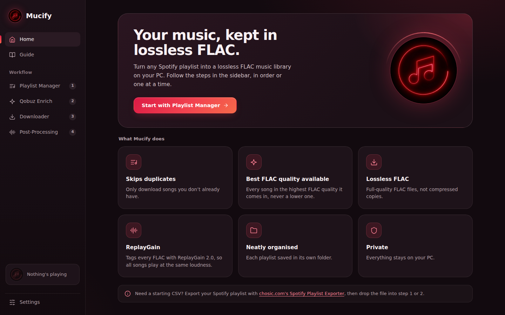
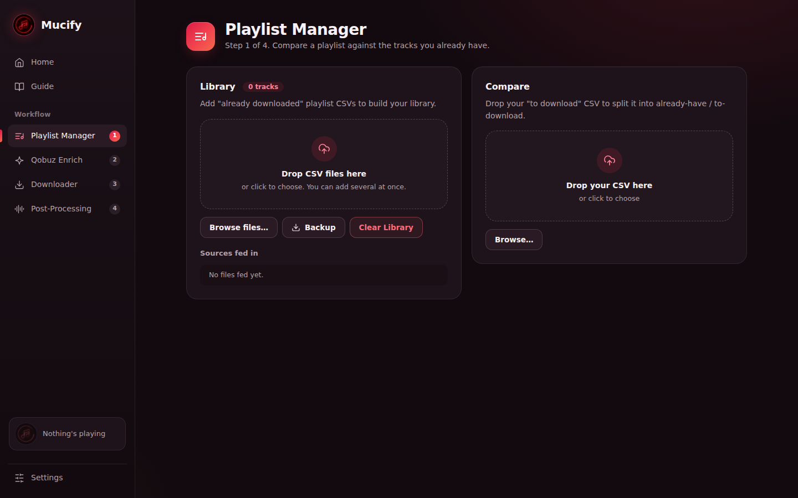
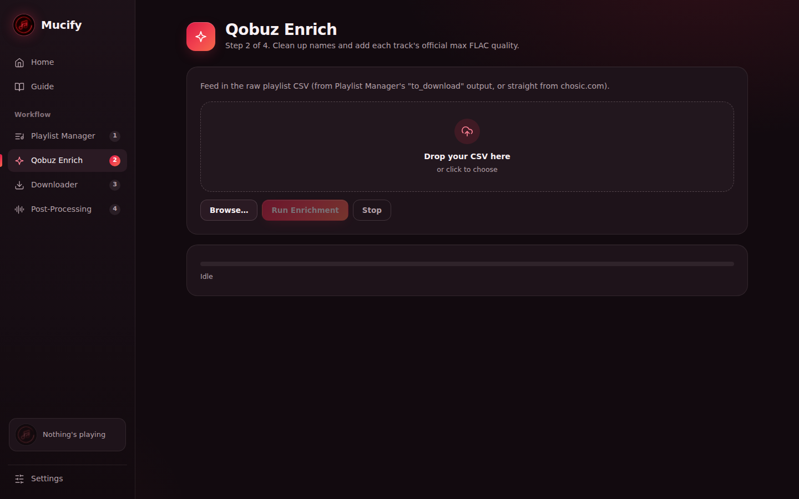
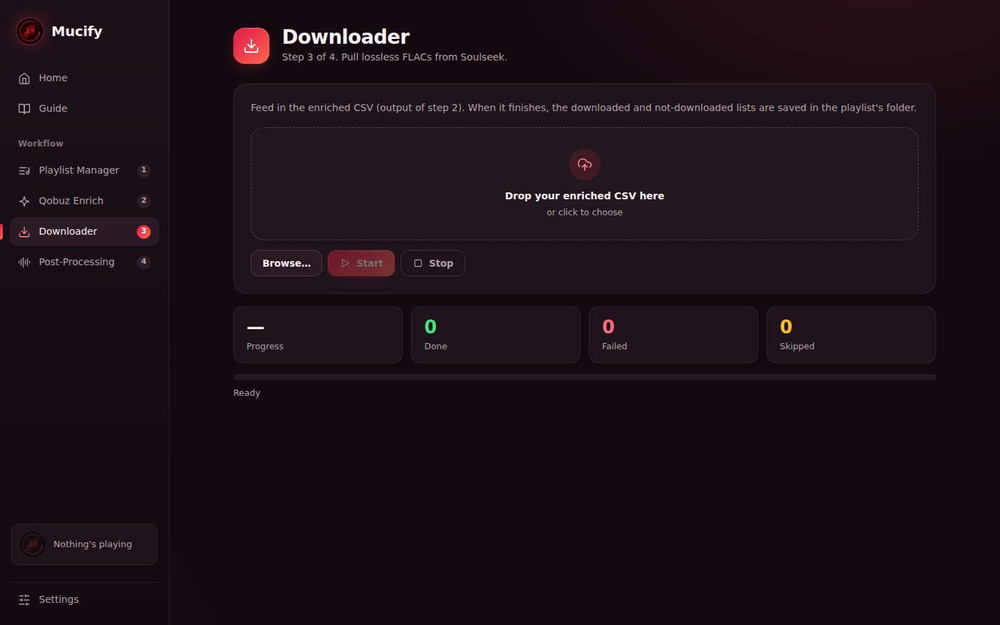
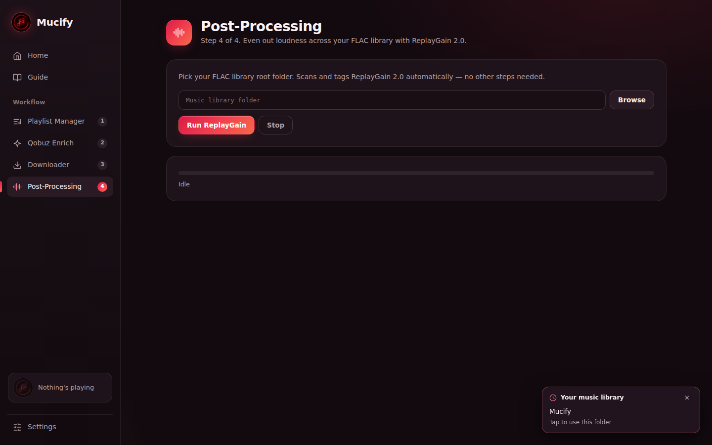
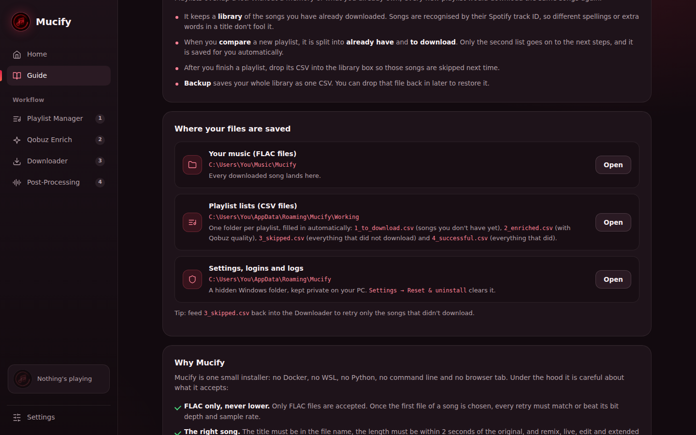
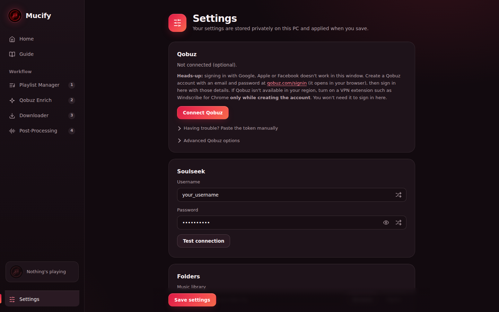

# Mucify

### Lossless FLAC from your Spotify playlists, in one tiny Windows app.

**No Docker. No WSL. No Python. No command line. Just a ~26 MB installer.**

[**⬇ Download**](https://github.com/dineshmageman007-sketch/Mucify/releases/latest) · [Why Mucify](#why-mucify) · [How it works](#how-it-works) · [Screenshots](#screenshots) · [FAQ](#faq)

 

## Feedback

Tried it? I'd love to know how easy it was to set up and use.

- Was installation smooth, or did you get stuck anywhere?
- Anything confusing in the UI?
- What's one thing you'd change?

👉 [Leave quick feedback](https://github.com/dineshmageman007-sketch/Mucify/issues/new?title=Feedback&labels=feedback)

---

## Why Mucify

Turn any Spotify playlist into a **lossless FLAC library** on your PC. Mucify skips what you already own, finds the best FLAC for every song, saves each playlist in its own tidy folder, and evens out the loudness with ReplayGain 2.0. You click, it works.

- 🪶 **Tiny and fast.** One installer of about 26 MB. It starts in a moment and runs as a normal desktop app.
- 🚫 **No Docker, no WSL, no Python, no terminal, no browser tab.** Install it like any other Windows program.
- 🎯 **FLAC only, and never lower.** Once the first file of a song is picked, every retry must match or beat its bit depth and sample rate.
- 🔍 **Careful matching.** The title has to be in the file name, the length must be within 2 seconds, and remix, live and edit versions are skipped unless you asked for them.
- 🔁 **It doesn't give up easily.** Slow or stalled sources are dropped and the next one is tried, up to 15 attempts per song.
- 📚 **Never downloads the same song twice.** The Playlist Manager remembers your library across every playlist.
- 🔊 **ReplayGain 2.0** tags your whole FLAC library so every song plays at the same loudness.
- 🗂 **One folder per playlist**, with automatic lists of what downloaded and what didn't.
- 🎧 **Built-in mini player.** Pick a file or a whole folder of MP3/FLAC and shuffle it while you work.
- 🔒 **Private.** No accounts, no ads, no telemetry. Everything stays on your PC.
- 🆓 **Free and open source** (GPL-3.0-or-later).

## Screenshots

<table>
  <tr>
    <td width="50%"> <b>1 · Playlist Manager</b>: compare a playlist with what you own</td>
    <td width="50%"> <b>2 · Qobuz Enrich</b>: official max quality per track</td>
  </tr>
  <tr>
    <td width="50%"> <b>3 · Downloader</b>: lossless FLACs from Soulseek</td>
    <td width="50%"> <b>4 · Post-Processing</b>: ReplayGain 2.0</td>
  </tr>
  <tr>
    <td width="50%"> <b>Guide</b>: where everything is saved, explained in the app</td>
    <td width="50%"> <b>Settings</b>: logins, folders, background music</td>
  </tr>
</table>

## Install

1. Download **`Mucify-Setup-1.0.0.exe`** from the [latest release](https://github.com/dineshmageman007-sketch/Mucify/releases/latest).
2. Run it and click through the installer. It adds Start Menu and Desktop shortcuts, and installs Microsoft's WebView2 runtime if your PC doesn't have it yet.
3. Open **Mucify**. The first-run setup takes about a minute: a Soulseek login (a random one is filled in for you), an optional Qobuz connection, and Mucify prepares the folders itself.

> **"Windows protected your PC"?** Mucify is new and the installer isn't code-signed yet, so Windows SmartScreen warns about every unsigned app. Click **More info → Run anyway**. Every release lists a SHA-256 checksum so you can verify your download, and the whole app is open source and built on GitHub.

Prefer no installer? Each release also has a **portable zip**: unzip and run `Mucify.exe`.

**Requirements:** Windows 10 or 11 (64-bit). Nothing else.

## How it works

| | Step | What it does |
|---|---|---|
| **1** | **Playlist Manager** | Keeps a library of the songs you already have (by Spotify track ID) and splits each new playlist into *already have* and *to download*. |
| **2** | **Qobuz Enrich** | Cleans up the names and looks up each song's official best quality. Optional: without Qobuz every song uses 24-bit / 48 kHz as its limit. |
| **3** | **Downloader** | Finds the best matching FLAC on Soulseek and downloads it, with automatic retries. |
| **4** | **Post-Processing** | Writes ReplayGain 2.0 tags across your FLAC library. |

Each playlist gets its own folder with `1_to_download.csv`, `2_enriched.csv`, `3_skipped.csv` (everything that did **not** download) and `4_successful.csv`. Feed `3_skipped.csv` back into the Downloader to retry only the missing songs. The in-app **Guide** explains all of this, including your exact folder locations.

Need a starting CSV? Export your Spotify playlist with [chosic.com's Spotify Playlist Exporter](https://www.chosic.com/spotify-playlist-exporter/).

## FAQ

<b>Is this legal?</b>

Mucify doesn't host or provide any music, and it doesn't download from Spotify or Qobuz. It organises your playlists and drives the bundled Soulseek downloader. What you download is your responsibility: only download music you have the right to obtain in your country, and follow the terms of the services you connect to. See the [disclaimer](DISCLAIMER.md).

<b>Do I need a Qobuz account?</b>

No, it's optional. With Qobuz connected, Mucify looks up each song's official maximum quality (bit depth and sample rate). Without it, every song uses 24-bit / 48 kHz as its limit. Sign in with an email and password: Google, Apple and Facebook sign-in don't work inside Mucify's window.

<b>Why only FLAC?</b>

Because the point is a lossless library. Only FLAC files are accepted, and Mucify never settles for lower quality than the first file it picked for a song.

<b>Why does Windows show a warning when I install?</b>

New, unsigned apps always trigger Windows SmartScreen until they build a reputation. Choose **More info → Run anyway**. You can verify the file with the SHA-256 checksum listed on the release page.

<b>Does Mucify send my data anywhere?</b>

No telemetry, no accounts, no ads. It only talks to the services you use (Soulseek and, optionally, Qobuz). Your Soulseek password and Qobuz token are stored in plain text on your PC, like most small desktop tools do, so don't share that folder. Details: [PRIVACY.md](PRIVACY.md).

<b>How do I start over or uninstall completely?</b>

*Settings → Reset & uninstall* clears all settings, logins and app data (and, only if you tick the box, your Mucify music folder). The Windows uninstaller offers the same clean-up.

<b>Windows only?</b>

For now, yes. Mucify is built for Windows 10/11 and uses Microsoft's WebView2 for its window.

## Ideas & help wanted

Light theme, more playlist sources, localisation, signed installers (via SignPath), a winget package. If one of these interests you, open an issue or a pull request.

## Contributing

Bug reports and pull requests are welcome. See [docs/DEVELOPING.md](docs/DEVELOPING.md) to build from source, and [SECURITY.md](SECURITY.md) to report a vulnerability privately. If Mucify saves you time, a ⭐ helps other people find it.

## License, credits & legal

- **License:** free software under the **GNU GPL v3.0 or later**, see [LICENSE](LICENSE). It comes with no warranty.
- **Created by mageman007** ([GitHub](https://github.com/dineshmageman007-sketch)) and contributors, see [CREDITS.md](CREDITS.md). The icon is AI-generated artwork.
- **Built on** [sldl](https://github.com/fiso64/sockseek) (AGPL-3.0, bundled v2.6.0), [rsgain](https://github.com/complexlogic/rsgain) (BSD-2-Clause) and others, see [THIRD_PARTY.md](THIRD_PARTY.md).
- **Disclaimer:** not affiliated with Qobuz, Soulseek, Spotify or any service it works with, see [DISCLAIMER.md](DISCLAIMER.md).
- **Privacy:** [PRIVACY.md](PRIVACY.md).

Everything above is also inside the app under *Guide* and *Settings → About & legal*.
